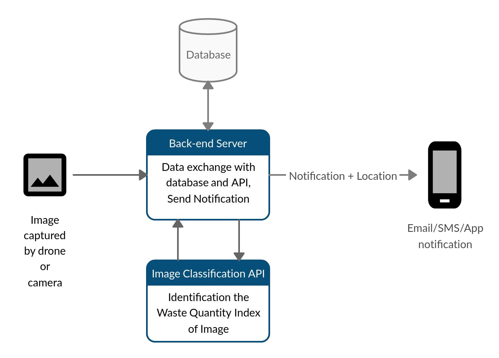

# Geo Tracking for Waste Management

This is an AI based drone software for geo tracking of wastes. The solution software takes an image captured by drone or a vehicle and location of image as input and perform the following task:
 - Detect if there is waste in the image and classify if its high waste or low waste.
 - Tag the image with its location and update the database with waste quality, location, date and timing of the image.
 - Send an alert to the nearest waste management Government officer for quick action.
 - Create a map visualization for detecting areas with high waste. The visualisation varied with time would also be provided.

## Technology Stack

 - Python (flask)
 - MySQL
 - Android (mobile app)
 - Google Maps API
 - ResNet - machine learning algorithm for image classification

## Data Flow

## Team Members

 - Mansee Agrawal (leader)
 - Anjali Nayak
 - Harshika Urkude
 - Prashant Jha
 - Snigdha Singh
 - Vinod Kumar Gupta

## Note

None of the file(s) can be copied or shared without permission.
